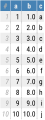

# BrowseTables.jl

<!--


 -->
[](https://travis-ci.org/tpapp/BrowseTables.jl)
[](http://codecov.io/github/tpapp/BrowseTables.jl?branch=master)

Julia package for browsing tables that that implement the [Tables.jl](https://github.com/JuliaData/Tables.jl) interface, as HTML.

## Installation

The package is registered, install with

```julia
pkg> add BrowseTables
```

## Usage

```julia
using BrowseTables, Tables
# make example table, but any table that supports Tables.jl will work
table = Tables.columntable(collect(i == 5 ? (a = missing, b = "string", c = nothing) :
                                   (a = i, b = Float64(i), c = 'a'-1+i) for i in 1:10))
open_html_table(table) # open in browser
```

The package exports three symbols:

1. `write_html_table` writes a table to a HTML file,
2. `open_html_table` writes the table and opens it in a browser using [DefaultApplication.jl](https://github.com/tpapp/DefaultApplication.jl),
3. `TableOptions` can be used to customize table appearance and HTML options for the above two functions.

Please read the docstrings for further information. That said, the primary design principle of this package is that it should “just work”, without further tweaking.

## How it looks

The above table renders as


